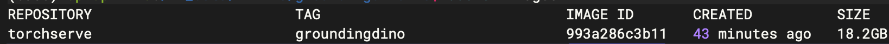

# GroundingDINO Deployed in Docker

## Prepare files

### Download model files from huggingface

> [download groundingdino files](https://github.com/IDEA-Research/GroundingDINO) |  [download bert files](https://huggingface.co/bert-base-uncased/tree/main)

- `groundingdino_swint_ogc.pth`
- `GroundingDINO_SwinT_OGC.py`
- `bert-base-uncased/config.json`
- `bert-base-uncased/pytorch_model.bin`
- `bert-base-uncased/tokenizer_config.json`
- `bert-base-uncased/tokenizer.json`
- `bert-base-uncased/vocab.txt`

> Tips

```sh
# download files
huggingface-cli download bert-base-uncased config.json pytorch_model.bin tokenizer_config.json tokenizer.json vocab.txt \
 --local-dir ./ --local-dir-use-symlinks False
```

### Prepare the handler file

> shown in repository.


## Build image

```sh
# build with plain output
docker build -t torchserve:groundingdino . --progress plain
```


### Test the image

```sh
docker run --rm -it --gpus all torchserve:groundingdino bash
# check the os env like the test/test-env.py
```

## Compile mar package

```sh
# compile mar package
cd /hw_data/llm-ws/groundingdino-ws
docker run --rm -it -v $(pwd):/data -w /data torchserve:groundingdino bash -c "torch-model-archiver --model-name groundingdino --version 1.0 --serialized-file groundingdino_swint_ogc.pth --handler grounding_dino_handler.py --extra-files GroundingDINO_SwinT_OGC.py,bert-base-uncased/"
```


## Deploy with Container

```sh
# deploy
cd /hw_data/llm-ws/groundingdino-ws
docker run -d --name groundingdino --gpus all -v $(pwd)/model_store:/model_store -v $(pwd)/config.properties:/cfg/config.properties  -p 9880:8080 -p 9881:8081 -p 9882:8082 torchserve:groundingdino bash -c "torchserve --start --foreground --model-store /model_store --models groundingdino=groundingdino.mar --ts-config /cfg/config.properties"
```

## Infer Code

```python
import requests
import base64
import time
# URL for the web service
url = "http://127.0.0.1:8080/predictions/groundingdino"
headers = {"Content-Type": "application/json"}

# Input data
with open("test.png", "rb") as f:
    image = f.read()

data = {
        "image": base64.b64encode(image).decode("utf-8"), # base64 encoded image or BytesIO
        "caption": "person", # text prompt, split by "." for multiple phrases
        "box_threshold": 0.25, # threshold for object detection
        "caption_threshold": 0.25 # threshold for text similarity
        }

# Make the request and display the response

resp = requests.post(url=url, headers=headers, json=data)
outputs = resp.json()
```


## Plus

- QA: 

```
NameError: name '_C' is not defined
```

- Solution:
```sh
add the env CUDA_HOME/TORCH_CUDA_ARCH_LIST
```
